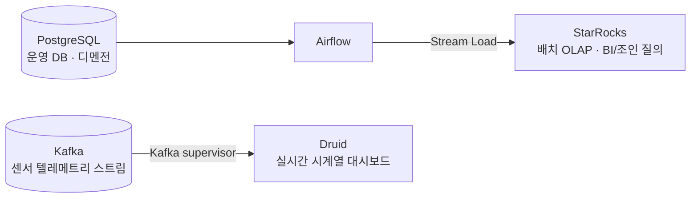

# data-platform-skeleton

> Energy/weather telemetry pipeline skeleton: PostgreSQL and Kafka sources, orchestrated by Airflow into StarRocks (OLAP serving) and Druid (real-time time-series).

## 설계 의도

- **도메인은 일반적인 센서/에너지 텔레메트리로 고정한다.** 특정 회사와 무관한 예시 스키마만 쓴다.
- **오케스트레이션(Airflow)과 저장/서빙(StarRocks·Druid)의 경계를 분리한다.** Airflow는 "언제·무엇을·어떤 순서로"만 책임지고, 적재·집계·업서트 모델링은 StarRocks DDL과 로더가 책임진다.
- **멱등성(idempotency)을 기본 전제로 둔다.** 증분 적재는 high-watermark로 경계를 관리하고, Stream Load label로 재시도 시 중복 적재를 막는다. 백필은 파티션 단위로만 덮어쓰고 전체 재적재(full-refresh)를 하지 않는다.
- **데이터 품질 게이트는 skip이 아니라 fail이다.** row-count·null-ratio·freshness 위반은 태스크를 실패시켜 다운스트림을 막고 알림을 유발한다.
- **Druid → StarRocks 마이그레이션의 p95 개선 출처를 메커니즘 단위로 정리한다.** colocation join, materialized view rewrite, sort-key pruning, vectorized exec — `docs/druid-to-starrocks.md`.

## 구조

```
data-platform-skeleton/
├── docs/
│   ├── architecture.md          # source → Airflow → StarRocks/Druid → serving 전체 흐름
│   └── druid-to-starrocks.md     # 마이그레이션 근거와 p95 개선의 출처
├── airflow/                      # 오케스트레이션 (Airflow 2.10, TaskFlow API)
│   ├── dags/ingest_incremental.py    # 증분 적재 (멱등, high-watermark)
│   ├── dags/backfill_partitioned.py  # 파티션 단위 백필 (no full-refresh)
│   ├── dags/data_quality_checks.py   # 실패시키는 DQ 게이트
│   └── include/                       # 공유 헬퍼 (watermark, dq)
├── starrocks/                    # OLAP 서빙: 3가지 테이블 모델 + 로더 + 최적화 노트
│   ├── ddl/                      # Duplicate / Aggregate / Primary Key
│   └── load/                     # Stream Load, Routine Load
└── druid/                        # 실시간 시계열 인제스트 스펙
```

## 데이터 흐름



- 배치·조인 중심 분석 질의 → StarRocks
- 실시간 append-only 시계열 → Druid
- 두 경로를 언제 쓰는지는 `docs/architecture.md` 참고.

## 검증 방법

- Airflow DAG: `python -m py_compile airflow/dags/*.py` (문법 검증. Airflow 설치 시 import까지 확인)
- Druid 스펙: `python -c "import json; json.load(open('druid/ingestion_spec.json'))"`
- StarRocks DDL: 세 가지 테이블 모델은 StarRocks 공식 문법 기준으로 작성. 방언 가정은 각 파일 주석에 명시.
